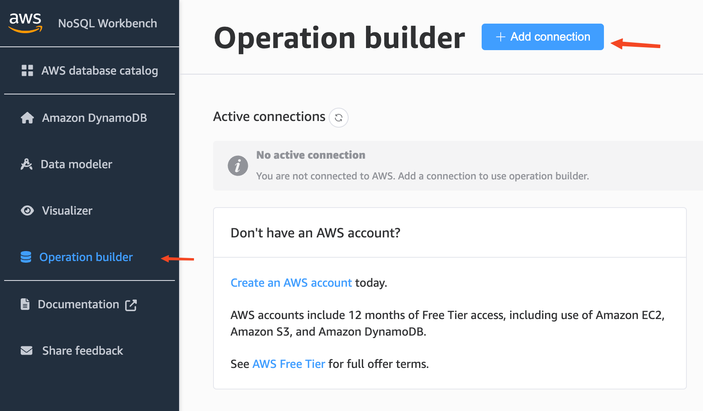
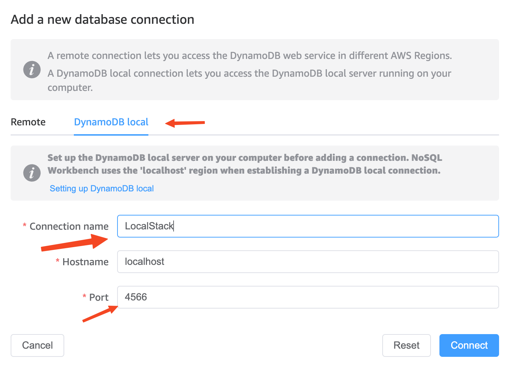
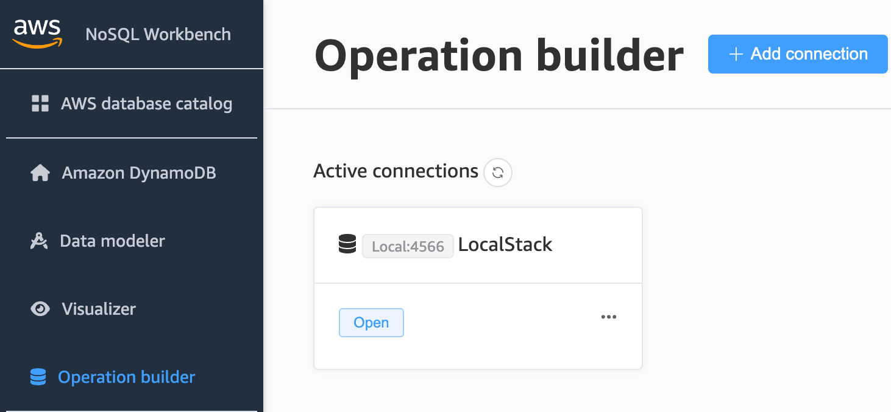
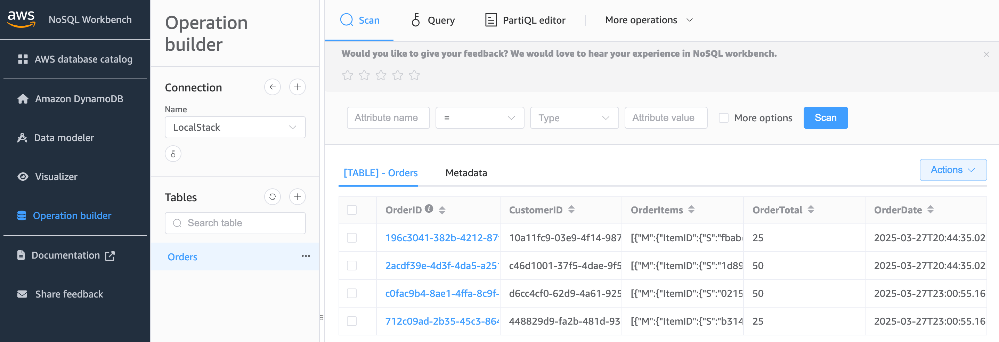

# Intro

This is just a simple sample built using AWS Javascript SDKv3 to interact with DynamoDB. 

It leverages the following classes:
- From '[@aws-sdk/client-dynamodb](https://docs.aws.amazon.com/AWSJavaScriptSDK/v3/latest/client/dynamodb/)'
    - [CreateTableCommand](https://docs.aws.amazon.com/AWSJavaScriptSDK/v3/latest/client/dynamodb/command/CreateTableCommand/) : Creates table
    - [DeleteTableCommand](https://docs.aws.amazon.com/AWSJavaScriptSDK/v3/latest/client/dynamodb/command/DeleteTableCommand/) : Deletes table
    - [DynamoDBClient](https://docs.aws.amazon.com/AWSJavaScriptSDK/v3/latest/client/dynamodb/) : Connection manger to access DynamoDB
- From '[@aws-sdk/lib-dynamodb](https://docs.aws.amazon.com/AWSJavaScriptSDK/v3/latest/Package/-aws-sdk-lib-dynamodb/)'
    <br>
    Simplifies working with items in Amazon DynamoDB by abstracting away the notion of attribute values. 
    - [BatchGetCommand](https://docs.aws.amazon.com/AWSJavaScriptSDK/v3/latest/Package/-aws-sdk-lib-dynamodb/Class/BatchGetCommand/) : Helper class to get multiple records into DynamoDB
    - [BatchWriteCommand](https://docs.aws.amazon.com/AWSJavaScriptSDK/v3/latest/Package/-aws-sdk-lib-dynamodb/Class/BatchWriteCommand/) : Helper class to write multiple records into Dynamo DB

## Prequisites
- [Docker](https://docs.docker.com/get-started/get-docker/)
- [Docker-Compose](https://docs.docker.com/compose/install/)
- [Deno](https://docs.deno.com/runtime/)

## How to run

A docker compose file is provided to you to run an instance of [LocalStack](https://localstack.cloud).
```bash
docker-compose up -d
```

This example provides two methods to view or run the code. 

First you must install any dependencies needed to run the code.

```bash
deno install
```

Then you can run the `main.ts` file directly by using the following:

```bash
deno run start
```

### Jupyter Notebook

To get the deno jupyter runtime installed and running.

```bash
deno jupyter
```
If you have [VS Code](https://code.visualstudio.com) you can install the [Jupyter Notebook Extension](https://marketplace.visualstudio.com/items?itemName=ms-toolsai.jupyter) and run the selected deno runtime.

Here is a link to guide you https://docs.deno.com/runtime/reference/cli/jupyter/.

## View in AWS NoSQL Workbench

1. Download [AWS NoSQL Workbench](https://docs.aws.amazon.com/amazondynamodb/latest/developerguide/workbench.settingup.html)
2. At the main screen click on `Operation builder` -> `+ Add Connection` 
3. At the switch to the `DynamoDB local` tab and fill in the `Connection name` to what you prefer in this case we used Localstack and change the `Port` to `4566` if you plan on using the LocalStack docker container provided. 
4. You should see this 
5. Open the connection and assuming you ran code to create the DB adding items from the jupyter notebook; you can see the following: 